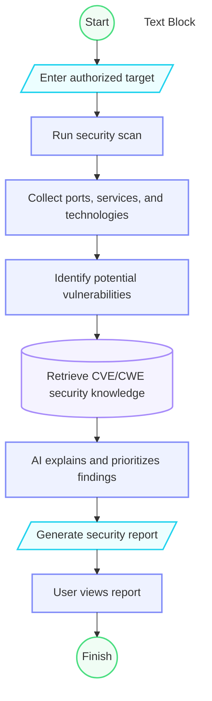

## Main features

### 1. Target Input

* Accept an authorized IP address, domain, or web application.
* Validate the target before scanning.

### 2. AI Scan Planning

* Understand the security assessment objective.
* Select the appropriate scanning steps.
* Adapt the workflow based on scan results.

### 3. Security Tool Integration

* Execute selected security tools.
* Collect and process their results.
* Use a limited set of tools to keep the project simple and maintainable.

### 4. Vulnerability Analysis

* Analyze scanner results using an AI model.
* Identify potential vulnerabilities and security misconfigurations.
* Extract relevant evidence.
* Classify findings by severity.

### 5. Vulnerability Verification

* Perform additional checks on potential vulnerabilities.
* Validate findings before reporting them.
* Reduce false positives.

### 6. Security Report

* Generate a structured security report.
* Include:

  * Vulnerability
  * Severity
  * Evidence
  * Description
  * Verification result
  * Recommendation

## Workflow

```text
Target
  |
  v
AI Agent
  |
  v
Scan Planning
  |
  v
Security Tools
  |
  v
Result Analysis
  |
  v
Vulnerability Detection
  |
  v
Verification
  |
  v
Security Report
```

## Functional Requirements

### FR1 — Target Input

The user must be able to provide an authorized target for scanning.

Examples:

```text
192.168.1.10
example.local
```

The system must only be used against systems for which the user has authorization.

### FR2 — Security Scanning

The agent must perform an authorized security scan.

The scanner should be able to discover:

* Open ports
* Running services
* Service versions
* Technologies
* Potential attack surface information

Example:

```text
Target: 192.168.1.10

Port 22  -> SSH
Port 80  -> HTTP
Port 443 -> HTTPS
```

### FR3 — Vulnerability Identification

The system must analyze scanner results and identify potential vulnerabilities.

Example:

```text
Service: Apache
Version: X.X

        |
        v

Vulnerability Analyzer
        |
        v

Potential vulnerability
```

The system should distinguish between a potential vulnerability and a confirmed vulnerability.

### FR4 — Vulnerability Knowledge Retrieval

The system must retrieve relevant cybersecurity information from a trusted knowledge base.

Possible sources include:

* CVE information
* CWE information
* Security documentation
* Vulnerability descriptions
* Remediation guidance

The RAG component should provide relevant context to the AI model.

### FR5 — AI Analysis

The LLM must analyze vulnerability findings using:

* Scanner results
* Retrieved cybersecurity knowledge
* Vulnerability information
* Evidence collected during the scan

The AI should produce:

* Vulnerability explanation
* Potential impact
* Evidence
* Security context
* Remediation suggestions

### FR6 — Report Generation

The system must generate a structured security report.

A report should contain:

```text
Target
Scan Date
Finding
Severity
Evidence
Description
Potential Impact
Remediation
```

Example:

```text
Finding: Vulnerable Web Service

Severity: High

Evidence:
Detected service version X.X

Description:
The detected service may be affected by a known vulnerability.

Impact:
An attacker may potentially exploit the vulnerable component.

Remediation:
Upgrade the affected service to a supported version.
```

### FR7 — Scan History

The system may store basic information about previous scans.

Possible information:

* Target
* Scan date
* Findings
* Severity
* Generated report

This feature can be implemented after the core MVP is working.

---

# Non-Functional Requirements

## NFR1 — Security

The system must only perform scans against authorized targets.

The agent should avoid automatically exploiting discovered vulnerabilities.

The primary purpose is:

```text
Discovery
+
Analysis
+
Reporting
```

rather than automatic exploitation.

## NFR2 — Accuracy

The AI must not automatically treat every scanner finding as a confirmed vulnerability.

The system should distinguish between:

```text
Detected
    !=
Confirmed
```

AI-generated conclusions should be based on available evidence.

## NFR3 — Explainability

The system should provide evidence and context for AI-generated findings.

Example:

```text
Finding
   |
   +-- Evidence
   |
   +-- Vulnerability information
   |
   +-- AI explanation
   |
   +-- Remediation
```

This is especially important because LLMs can behave as black-box models.

## NFR4 — Performance

The system should perform scanning and AI analysis within a reasonable amount of time.

Performance should remain acceptable when processing multiple findings.

## NFR5 — Modularity

Each major component should be independent.

```text
Scanner
   |
Analyzer
   |
RAG
   |
LLM
   |
Report Generator
```

This allows individual components to be replaced or improved without redesigning the entire system.

## NFR6 — Maintainability

The project should use a modular architecture with clear separation between:

* Scanning
* Vulnerability analysis
* Knowledge retrieval
* AI analysis
* Reporting

---

# Proposed Technology Stack

| Component                 | Technology                   |
| ------------------------- | ---------------------------- |
| Programming Language      | Python                       |
| Security Scanner          | Nmap                         |
| Vulnerability Information | CVE / NVD / CWE              |
| RAG                       | FAISS or Chroma              |
| Embeddings                | Sentence Transformers        |
| AI Model                  | Local/Open-Source LLM or API |
| Backend                   | FastAPI                      |
| Database                  | SQLite                       |
| Report Format             | Markdown / HTML / PDF        |
| Containerization          | Docker                       |
| Version Control           | Git / GitHub                 |
| Operating System          | Linux / Kali Linux           |

The exact technologies can be changed during development.

---
# System Architecture

```text
                         +-------------+
                         |    User     |
                         +------+------+
                                |
                                v
                    +-----------------------+
                    | AI Vulnerability      |
                    | Scanner Agent         |
                    +-----------+-----------+
                                |
                                v
                    +-----------------------+
                    | Security Scanner      |
                    |        Nmap            |
                    +-----------+-----------+
                                |
                                v
                    +-----------------------+
                    | Vulnerability         |
                    | Analyzer              |
                    +-----------+-----------+
                                |
                       +--------+--------+
                       |                 |
                       v                 v
                +------------+     +------------+
                | RAG /      |     | Findings / |
                | Knowledge  |     | Evidence   |
                | Base       |     +------+-----+
                +-----+------+            |
                      |                   |
                      +---------+---------+
                                |
                                v
                    +-----------------------+
                    | LLM / AI Model        |
                    +-----------+-----------+
                                |
                                v
                    +-----------------------+
                    | Report Generator      |
                    +-----------+-----------+
                                |
                                v
                    +-----------------------+
                    | Security Report       |
                    +-----------------------+
```

# Core Components

## 1. AI Vulnerability Scanner Agent

The main orchestrator of the system.

Responsibilities:

* Receive the target
* Start the scanning process
* Coordinate analysis
* Send relevant information to the AI components
* Generate the final result

## 2. Security Scanner

Responsible for collecting technical information about the target.

Possible information:

* Open ports
* Services
* Versions
* Technologies
* Network information

## 3. Vulnerability Analyzer

Processes scanner results and identifies potential security issues.

Responsibilities:

* Analyze detected services
* Match versions with vulnerability information
* Organize findings
* Prepare evidence for AI analysis

## 4. RAG / Knowledge Base

Provides external cybersecurity knowledge to the LLM.

Possible knowledge:

```text
CVE
CWE
Security advisories
Official documentation
Vulnerability descriptions
Remediation information
```

The purpose of RAG is to give the AI relevant information instead of relying only on its internal knowledge.

## 5. LLM / AI Model

Responsible for analyzing findings and generating understandable explanations.

The LLM should not directly perform network scanning.

Its role is primarily:

```text
Analyze
Explain
Summarize
Prioritize
Recommend remediation
```

## 6. Report Generator

Converts the AI analysis into a structured security report.

Possible output:

```text
Security Assessment Report
    |
    +-- Target
    +-- Scan Information
    +-- Findings
    +-- Severity
    +-- Evidence
    +-- Explanation
    +-- Impact
    +-- Remediation
```

---

# Security Principles

The project should follow these principles:

### Authorization First

Only scan systems for which permission has been obtained.

### Evidence-Based Analysis

AI conclusions should be connected to actual scanner results and trusted knowledge.

### Human Review

AI-generated findings should be considered analysis assistance, not absolute truth.

### No Automatic Exploitation

The initial version focuses on vulnerability discovery and analysis rather than automatically exploiting targets.

### Traceability

The system should preserve enough information to understand:

```text
What was scanned?
What was detected?
What information was retrieved?
What did the AI conclude?
Why?
```

---

# Final Project Pipeline

```text
User
 |
 | Target
 v
AI Agent
 |
 v
Nmap Scanner
 |
 | Scan Results
 v
Vulnerability Analyzer
 |
 | Findings
 v
RAG Knowledge Base
 |
 | Relevant Context
 v
LLM
 |
 | Analysis
 v
Report Generator
 |
 v
Security Report
```

## Project Focus

The project focuses on building a **practical AI-assisted vulnerability analysis agent**, combining traditional cybersecurity tools with:

* Vulnerability knowledge
* RAG
* LLM-based analysis
* Evidence-based reporting

The objective is to keep the architecture simple enough to implement while demonstrating the integration of **AI + Cybersecurity + Automated Security Analysis**.

# UML 
## Classe diagram 

```mermaid
---
config:
  theme: mc
---
classDiagram
    direction LR

    class User {
        +startScan(target)
        +viewReport()
    }

    class AIVulnerabilityScannerAgent {
        +runScan(target)
    }

    class Scanner {
        +scanTarget(target)
    }

    class VulnerabilityAnalyzer {
        +findVulnerabilities()
    }

    class KnowledgeBase {
        +getSecurityContext()
    }

    class LLMModel {
        +explainAndPrioritize()
    }

    class ReportGenerator {
        +createReport()
    }

    User "1" --> "1" AIVulnerabilityScannerAgent : starts scan
    AIVulnerabilityScannerAgent --> Scanner : requests scan
    Scanner --> VulnerabilityAnalyzer : raw results
    VulnerabilityAnalyzer --> KnowledgeBase : relevant findings
    KnowledgeBase --> LLMModel : security context
    LLMModel --> ReportGenerator : analysis
    ReportGenerator --> User : final report
```

## activity Diagram 

# PROJCET STRUCTURE 
```text
ai-vulnerability-scanner/
│
├── README.md
├── requirements.txt
├── .env.example
├── .gitignore
│
├── config/
│   └── config.yaml
│
├── src/
│   ├── main.py
│   │
│   ├── agent/
│   │   ├── __init__.py
│   │   └── orchestrator.py
│   │
│   ├── scanner/
│   │   ├── __init__.py
│   │   └── nmap_scanner.py
│   │
│   ├── analyzer/
│   │   ├── __init__.py
│   │   └── vulnerability_analyzer.py
│   │
│   ├── rag/
│   │   ├── __init__.py
│   │   ├── retriever.py
│   │   ├── embeddings.py
│   │   └── knowledge_base.py
│   │
│   ├── llm/
│   │   ├── __init__.py
│   │   └── model.py
│   │
│   ├── report/
│   │   ├── __init__.py
│   │   └── report_generator.py
│   │
│   ├── models/
│   │   ├── __init__.py
│   │   ├── scan_result.py
│   │   └── vulnerability.py
│   │
│   └── utils/
│       ├── __init__.py
│       └── logger.py
│
├── data/
│   ├── knowledge/
│   └── vector_db/
│
├── reports/
│
├── tests/
│   ├── test_scanner.py
│   ├── test_analyzer.py
│   ├── test_rag.py
│   └── test_report.py
│
└── docs/
    ├── architecture.md
    └── uml/
        ├── use-case.md
        ├── class-diagram.md
        └── sequence-diagram.md

```